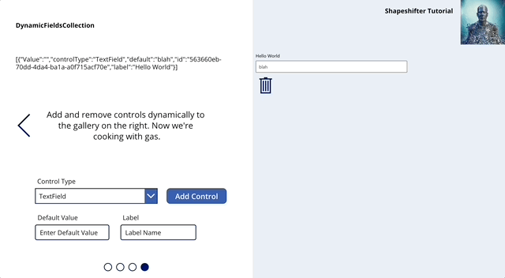

# Shapeshifter

A way to dynamically render controls in Power Apps

The inspiration for this control is that there is no way to do it in a Canvas App without toggling the show/hide of all controls which is ugly and hard to manage. It could be used to shrink the amount of static coding in a MDA approach too. I have the ambition to bring this to the world of SharePoint and Teams development also.

## Implemented Controls
* Fluent UI TextField
* Fluent UI DatePicker
* Fluent UI Slider
* Fluent UI Dropdown
* Fluent UI ChoiceGroup
* Fluent UI SpinButton
* Fluent UI StarRating

## How to use
Import the solution from our [releases area](https://github.com/brendon-colburn/shapeshifter/releases).  It has a sample Canvas App to help you understand the concept.
To work on the solution clone or fork this repo and build it out in VSCode. Upon importing this solution, you can either copy the included Cavas App as a template or you can import the Shapeshifter control into a new Canvas App.

## Want to contribute?
Help implement controls or establish more elegant approaches to the shapeshifter concept
